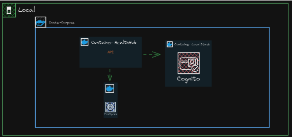
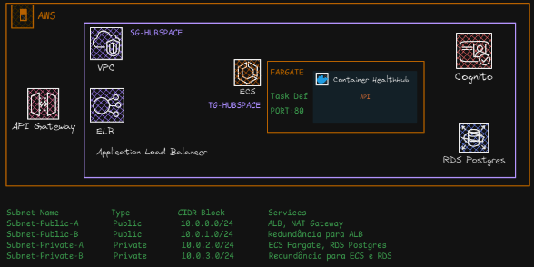
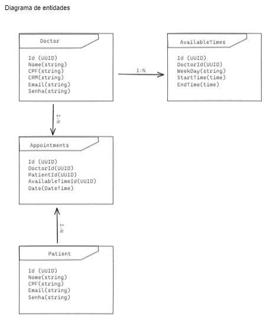

# HealthMedHub - MVP para Agendamento de Consultas

## Contexto do Projeto
A **Health&Med** está desenvolvendo um sistema para digitalizar o processo de agendamento de consultas médicas, visando a entrega de um MVP rápido e funcional. O **HealthMedHub** será implementado como uma **API Backend** utilizando .NET 8 e será baseado no conceito de **Clean Architecture**. O foco está na eficiência do desenvolvimento e na garantia de que a solução será facilmente escalável e integrável com a infraestrutura de produção na **AWS**.

## Justificativa para Monolito Moderno
Um **monólito moderno** foi escolhido devido à sua simplicidade para o desenvolvimento de um MVP, com as seguintes vantagens:

- **Facilidade de desenvolvimento e deploy inicial**: O monólito permite que todas as funcionalidades sejam desenvolvidas em uma única aplicação, acelerando o processo de entrega do MVP.
- **Menor complexidade**: No início, evita-se a complexidade de uma arquitetura distribuída, mantendo o foco em entregar funcionalidades críticas.
- **Escalabilidade horizontal e futura migração**: Conforme a aplicação cresce, ela pode ser particionada em microserviços sem grandes dificuldades.
- **Pipeline CI/CD simples**: O deploy de uma aplicação monolítica com Docker e GitHub Actions é menos complexo, ideal para um MVP.

## Clean Architecture
A escolha pela **Clean Architecture** garante que a aplicação seja estruturada de forma modular e separada em camadas, o que facilita a evolução do sistema e sua manutenção. As camadas centrais (entidades e casos de uso) são independentes das camadas externas (infraestrutura, frameworks), permitindo mudanças no banco de dados, APIs ou bibliotecas sem impactar a lógica de negócio.

## Arquitetura Proposta

### Tecnologias Utilizadas
- **Backend**: API RESTful em .NET 8.
- **Banco de Dados**: AWS RDS (PostgreSQL) para persistência de dados.
- **Mensageria**: AWS SQS para o envio de notificações de agendamento e gestão de concorrência.
- **Contêinerização**: Docker e Docker Compose para o empacotamento da aplicação e simulação de ambiente local.
- **CI/CD Pipeline**: GitHub Actions para automação de build, testes e deploy no AWS ECS.
- **Ambiente de Teste Local**: LocalStack para emulação dos serviços AWS localmente durante o desenvolvimento e teste.

### Componentes Arquiteturais
- **API Backend**: Interface que oferece endpoints para funcionalidades como cadastro de usuários, agendamento de consultas e envio de notificações.
- **Camada de Serviço**: Responsável pelas regras de negócio (ex.: validação de horários de consultas e envio de notificações via AWS SQS).
- **Camada de Acesso a Dados**: Comunicação com o banco de dados AWS RDS para armazenar informações de usuários, médicos, pacientes e consultas.
- **LocalStack**: Emula serviços da AWS (SQS, RDS) localmente para testes e desenvolvimento.
- **AWS ECS**: Orquestração da aplicação em produção utilizando contêineres Docker.

A estrutura será organizada conforme os princípios da Clean Architecture, com separação clara de responsabilidades entre camadas, de forma que a lógica de negócios fique isolada e independente da infraestrutura ou frameworks.

### Fluxo de Testes Locais com LocalStack
O **LocalStack** será utilizado para emular os serviços da AWS durante o desenvolvimento local. Isso permitirá:

- **Testes de integração com AWS SQS**: Validação do envio e recebimento de mensagens para simular o comportamento da fila de agendamentos.
- **Simulação do RDS**: Para testes locais do banco de dados, permitindo o desenvolvimento sem a necessidade de conexão direta com o ambiente AWS.

## Arquitetura da Solução

### Local:

### AWS:

## Resumo dos Endpoints

| Method | Endpoint                        | Description                                    |
|--------|----------------------------------|------------------------------------------------|
| POST   | /api/doctors/register            | Register doctors                               |
| POST   | /api/patients/register           | Register patients                              |
| POST   | /api/doctors/login               | Doctor login                                   |
| POST   | /api/patients/login              | Patient login                                  |
| POST   | /api/doctors/slots               | Register available slots (doctors)             |
| PUT    | /api/doctors/slots/{id}          | Edit available slots (doctors)                 |
| GET    | /api/doctors/slots               | List available slots (doctors)                 |
| GET    | /api/doctors/available           | List available doctors (patients)              |
| POST   | /api/appointments/book           | Book an appointment (patients)                 |
| GET    | /api/appointments/mine           | List patient’s booked appointments             |
| GET    | /api/appointments/notifications  | List appointment notifications (doctors)       |

## Diagrama de Entidades

## Relatórios de Custos com AWS

Estimativa de custos com a AWS baseada na arquitetura apresentada, incluindo os seguintes serviços:

1. **API Gateway**: Custo por chamadas (REST ou HTTP APIs) + transferência de dados.
2. **Elastic Load Balancer (ALB)**: Cobrança por hora de uso e pela quantidade de dados processados.
3. **ECS Fargate**: Cobrança pelo tempo de execução da tarefa (vCPU e memória alocada).
4. **RDS PostgreSQL**: Cobrança por instância de banco de dados, espaço em armazenamento e transferência de dados.
5. **Cognito**: Cobrança baseada no número de usuários ativos mensais (MAU) e solicitações de autenticação.
6. **IAM (usuários)**: Geralmente, sem custos diretos, mas cobra por alguns serviços adicionais relacionados a permissões.
7. **Transferência de Dados e Tráfego de Rede**: Custos de transferência de dados dentro e fora da VPC.

### Estimativa de Custos (em USD e BRL)

| Serviço                | Custo Estimado (USD) | Custo Estimado (BRL) |
|------------------------|----------------------|----------------------|
| API Gateway            | $3.50                | R$ 17,64             |
| ALB (Elastic Load Balancer) | $35.00               | R$ 176,40            |
| ECS Fargate            | $104.76              | R$ 528,00            |
| RDS PostgreSQL         | $50.00               | R$ 252,00            |
| Cognito                | $50.00               | R$ 252,00            |
| VPC/Subnets (NAT Gateway) | $77.40               | R$ 390,00            |
| Transferência de Dados | $45.00               | R$ 227,00            |
| **Total mensal estimado** | **$365.66**           | **R$ 1.843,43**       |

### Estimativa de Crescimento nos Próximos Meses (com picos de uso)
Supondo um aumento de 10% a cada mês nos custos devido ao aumento no tráfego e uso dos serviços, a progressão é:

| Mês  | Custo (USD) | Custo (BRL) |
|------|-------------|-------------|
| 1    | $365.66     | R$ 1.843,43 |
| 2    | $402.23     | R$ 2.027,77 |
| 3    | $442.45     | R$ 2.230,54 |
| 4    | $486.69     | R$ 2.453,59 |
| 5    | $535.36     | R$ 2.698,95 |

## Repositório GitHub
[HealthMedHub no GitHub](https://github.com/Leock9/HealthMed.Hub)

Video: https://youtu.be/Pz1gmvFQhXc
